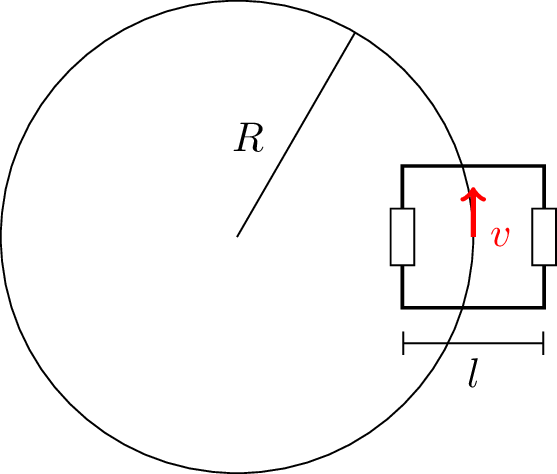

# Drive Kinematics

Drive kinematics are often overlooked in part due to their surface simplicity. Intuitively, for a tank drive, everyone knows that you provide the same voltage to both sides to go forward and opposite voltages to spin. Nevertheless, we'll present a method for deriving tank kinematics.

## Tank Kinematics

Consider the following configuration of a tank robot traveling with constant forward and angular velocity. Throughout this discussion, we will assume that the drive has one wheel per side \(this is generally accurate although certain configuration may have significant scrub/friction\).

Here the forward velocity is $$v$$ and the angular velocity is $$\omega$$. The length $$l$$ in the picture is called the track width; it's defined as the distance between the wheels \(point of contact is assumed to be in the middle of the wheels\). First, the circumference of the circle is $$\Delta x = 2\pi R$$ which implies the robot takes time $$t = \frac{\Delta x}{v} = \frac{2\pi R}{v}$$ to complete a single revolution. Now, we can calculate the wheel velocities: $$v_l = 2\pi (R - l / 2) \cdot \frac{v}{2\pi R} = v - v \cdot \frac{l}{2R}$$ and $$v_r = 2\pi (R + l / 2) \cdot \frac{v}{2\pi R} = v + v \cdot \frac{l}{2R}$$. However, we still aren't quite done. In one revolution around the circle, the robot itself also completes one spin relative to the global frame. Thus $$\omega = 2\pi \cdot \frac{v}{2\pi R} = v / R$$. Substituting, we are left with $$v_l = v - \frac{l\omega}{2}$$ and $$v_r = v + \frac{l\omega}{2}$$.

These are the inverse kinematics for the tank drive. Given the robot pose velocity, we can compute the velocities of the end-effectors \(useful for driving\). This 2-by-2 system can also be inverted to give the forward kinematics \(useful for dead reckoning\). Some quick napkin calculations will give $$v = \frac{v_r + v_l}{2}$$ and $$\omega=\frac{v_r - v_l}{l}$$.

