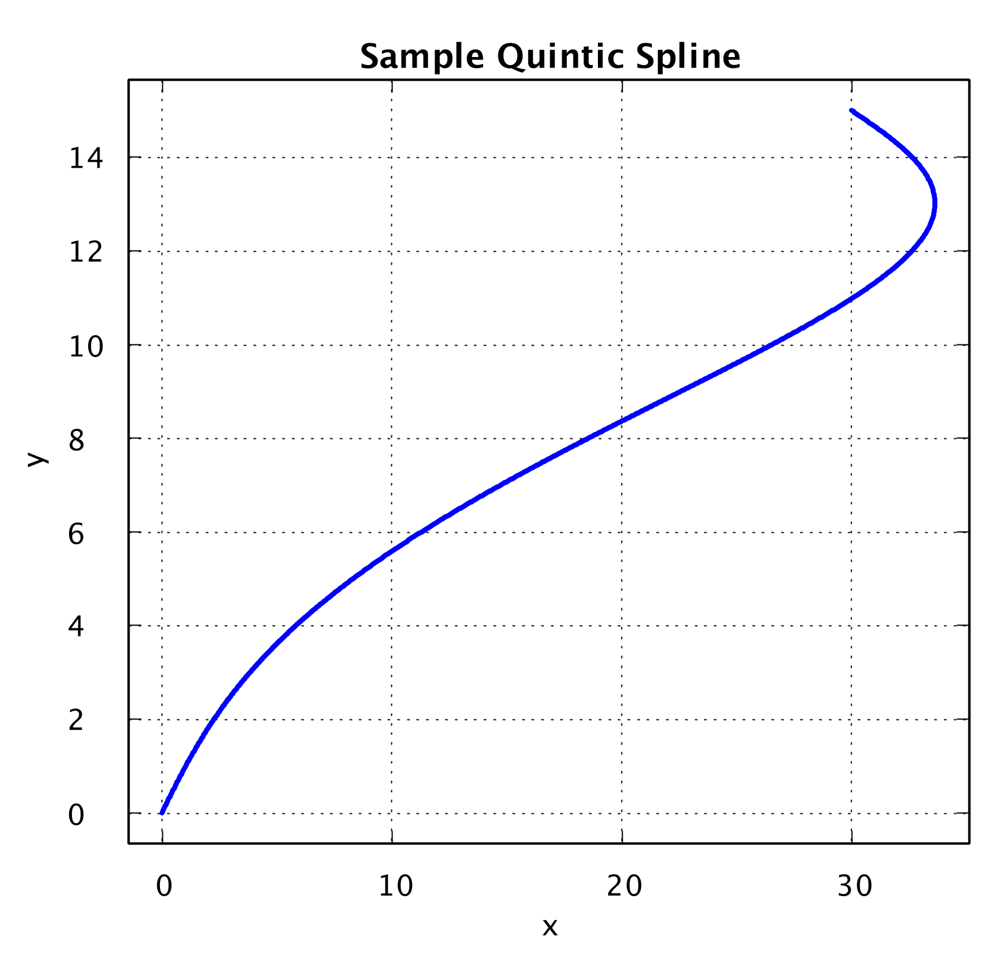

# Parametric Paths

With the coordinate transformations, paths can be specified at the global level \(i.e., not 'go forward 60 inches and turn 45 degrees right'\). Complex, abstract paths can now be devised without having to explicitly consider the robot velocities necessary to execute them.

## Lines

To describe these paths, we will use parametric curves. For our purposes, these curves are composed of two single variable functions $$x(t)$$ and $$y(t)$$ that together determine the path shape. Parametric lines take the form $$x(t) = x_0 + v_x \, t$$, $$y(t) = y_0 + v_y \, t$$. This can be represented more conveniently in the notation of vectors: $$\vec{r}(t) = \vec{x_0} + \vec{v} \, t$$ \(there is an intimate relationship between parametrics and vectors; they're often called vector-valued functions\). Lines and other parametric functions are often defined over the whole $$t$$ domains; however, for the purposes of constructing finite paths, the domain is constrained. Road Runner assumes parametric curves are only defined on $$[0, 1]$$.

To create a `LineSegment`, simply provide a starting vector and an ending vector.



```java
LineSegment line = new LineSegment(
    new Vector2d(0, 0),
    new Vector2d(50, 100)
);
Vector2d position = line.get(0.5);
```



```kotlin
val line = LineSegment(
    Vector2d(0.0, 0.0),
    Vector2d(50.0, 100.0)
)
val position = line[0.5]
```



## Splines

In addition to lines, there are built-in quintic splines. Unlike lines, splines can assume a variety of curved shapes. The shape of the spline is controlled by waypoints on either end that specify the desired position, first derivative, and second derivative.



The quintic spline above was generated with the following code:



```java
QuinticSpline spline = new QuinticSpline(
    new QuinticSpline.Waypoint(0, 0, 20, 20),
    new QuinticSpline.Waypoint(30, 15, -30, 10)
);
```



```kotlin
val spline = QuinticSpline(
    QuinticSpline.Waypoint(0.0, 0.0, 20.0, 20.0),
    QuinticSpline.Waypoint(30.0, 15.0, -30.0, 10.0)
)
```



As we'll see soon, there are more convenient methods of customizing splines without specifying derivatives directly.

## Heading Interpolation

For tank drives, specifying the $$(x, y)$$ position of the robot at every point along the path is sufficient to determine the full pose. In the literature, this is called the nonholonomic constraint and mandates that the robot most be oriented tangent to the path. However, for so-called holonomic drives, the heading is independent of the translational velocity, enabling more complex manuevers. For instance, a holonomic may traverse a spline while rotating or maintaining a constant heading \(relative to the global frame\).

Road Runner was designed with first-class holonomic support and provides a number of `HeadingInterpolator`s. The default \(and only option for nonholonomic drives\) interpolator is `TangentInterpolator`. Of the rest, the two most commonly used are `ConstantInterpolator` and `LinearInterpolator` for strafing and efficient pose-to-pose movements, respectively. The combination of a `ParametricCurve` and a `HeadingInterpolator` constitute a `PathSegment`. A number of distinct `PathSegment`s can be strung together into a single `Path`.

Here's an example demonstrating the construction of a `Path` from lower-level abstractions:



```java
LineSegment line = new LineSegment(
    new Vector2d(0, 0),
    new Vector2d(56, 24)
);
LinearInterpolator interp = new LinearInterpolator(
    Math.toRadians(30), Math.toRadians(45)
);
PathSegment segment = new PathSegment(line, interp);
Path path = new Path(segment);
```



```kotlin
val line = LineSegment(
    Vector2d(0.0, 0.0),
    Vector2d(56.0, 24.0)
)
val interp = LinearInterpolator(
    Math.toRadians(30.0), Math.toRadians(45.0)
)
val segment = PathSegment(line, interp)
val path = Path(segment)
```



## `PathBuilder`

Now this process of creating `Path`s is a bit tedious, and there is often duplicate information required to connect the segments. To make things easier, the `PathBuilder` class provides a more streamlined interface for `Path` construction.



```java
Path path = new PathBuilder(new Pose2d(0, 0, 0))
    .splineTo(new Pose2d(15, 15, 0))
    .lineTo(new Vector2d(30, 15))
    .build()
```



```kotlin
val path = PathBuilder(Pose2d(0.0, 0.0, 0.0))
    .splineTo(Pose2d(15.0, 15.0, 0.0))
    .lineTo(Vector2d(30.0, 15.0))
    .build()
```



